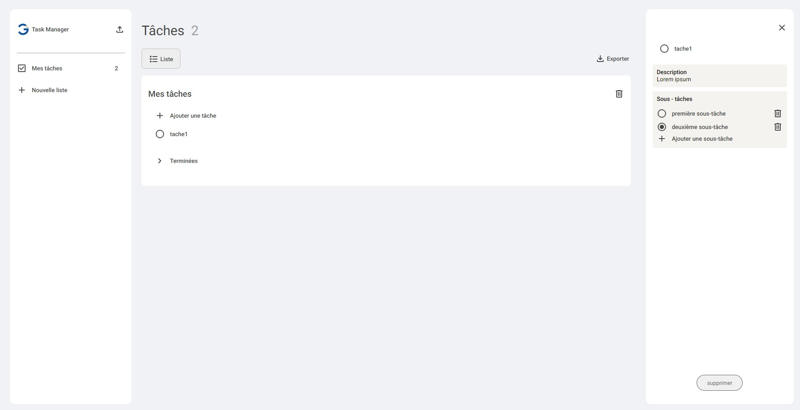

# Task Manager web app
This task manager allows users to import and export task data in JSON format. Users can generate tasks using AI, leveraging exported data and a prompt. The generated tasks can then be viewed and managed within the application.

